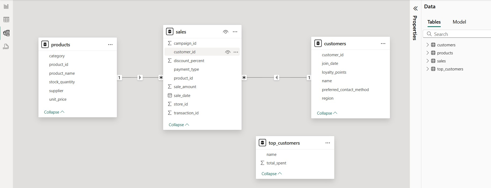
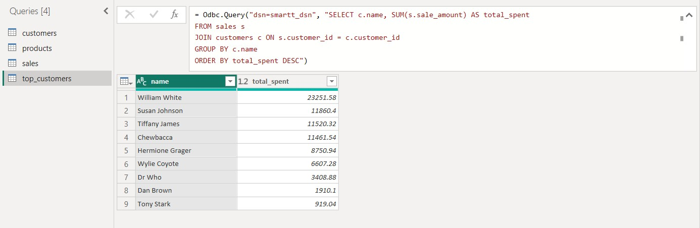
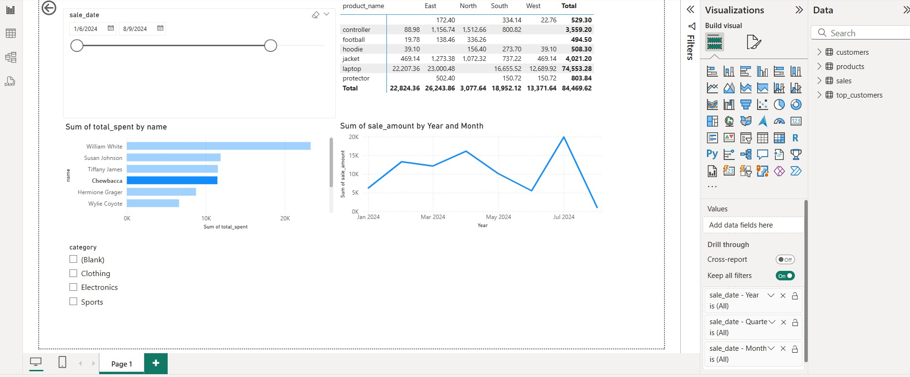
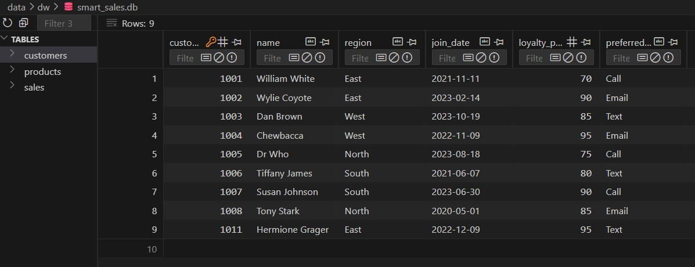
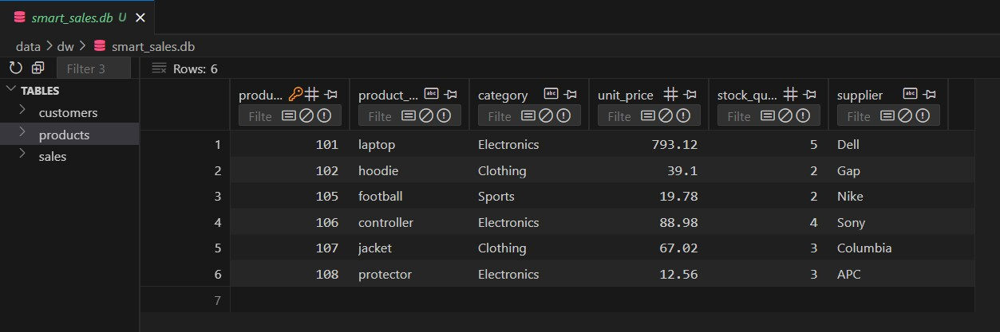
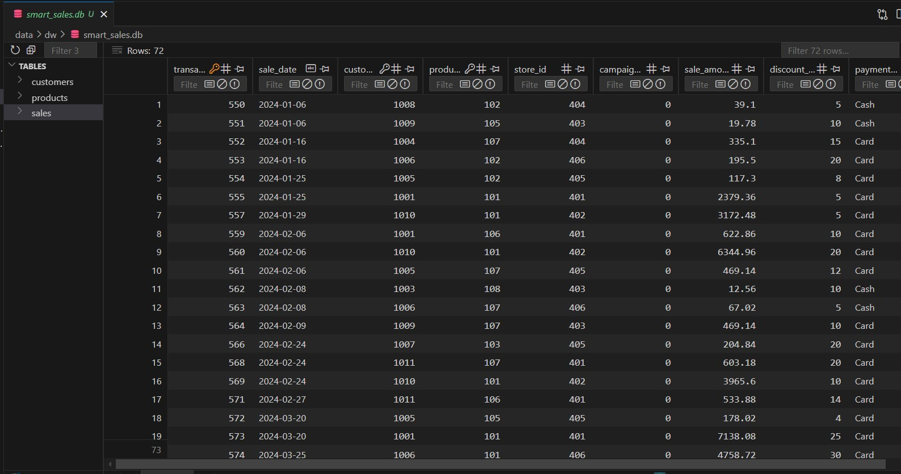

# smart-store-sgollanw
-----

## Project Setup Guide (1-Mac/Linux)

Run all commands from a terminal in the root project folder. 


### Step 1A - Create a Local Project Virtual Environment

```shell
python3 -m venv .venv
```

### Step 1B - Activate the Virtual Environment

```shell
source .venv/bin/activate
```

### Step 1C - Install Packages

```shell
python3 -m pip install --upgrade -r requirements.txt
```

### Step 1D - Optional: Verify .venv Setup

```shell
python3 -m datafun_venv_checker.venv_checker
```

### Step 1E - Run the initial project script

```shell
python3 scripts/data_prep.py
```

### Step 1F - Run the Data Preparation Scripts to cleanup the data

```shell
python3 scripts/data_preparation/prepare_customers_data.py
python3 scripts/data_preparation/prepare_products_data.py
python3 scripts/data_preparation/prepare_sales_data.py
```

-----

## Project Setup Guide (2-Windows)

Run all commands from a PowerShell terminal in the root project folder.

### Step 2A - Create a Local Project Virtual Environment

```shell
py -m venv .venv
```

### Step 2B - Activate the Virtual Environment

```shell
.venv\Scripts\activate
```

### Step 2C - Install Packages

```shell
py -m pip install --upgrade -r requirements.txt
```

### Step 2D - Optional: Verify .venv Setup

```shell
py -m datafun_venv_checker.venv_checker
```

### Step 2E - Run the initial project script

```shell
py scripts/data_prep.py
```

### Step 2F - Run the Data Preparation Scripts to cleanup the data

```shell
py scripts/data_preparation/prepare_customers_data.py
py scripts/data_preparation/prepare_products_data.py
py scripts/data_preparation/prepare_sales_data.py
```

-----


## Initial Package List (For Reference)

```
pip
setuptools
wheel
loguru
python-dotenv
pyttsx3
ipython
jupyter
ipykernel
ipywidgets
pandas
matplotlib
seaborn
```

## Commands Used (Frequently) to update GitHub 

```
# to check the status
git status
# to stage the files
git add .
# to commit with message
git commit -m "<<message to commit>>"
# to push into remote branch
git push -u origin main
```


-----


## Data warehouse Design


### Database Table Design

#### Customers Table

| Column Name              | Data Type | Constraints       | Description                          |
|--------------------------|-----------|-------------------|--------------------------------------|
| `customer_id`            | INTEGER   | PRIMARY KEY       | Unique identifier for each customer |
| `name`                   | TEXT      |                   | Name of the customer                |
| `region`                 | TEXT      |                   | Geographic region of the customer   |
| `join_date`              | TEXT      |                   | Date the customer joined            |
| `loyalty_points`         | INTEGER   |                   | Loyalty points earned by the customer |
| `preferred_contact_method` | TEXT    |                   | Preferred method of contact         |

#### Products Table

| Column Name      | Data Type | Constraints       | Description                          |
|------------------|-----------|-------------------|--------------------------------------|
| `product_id`     | INTEGER   | PRIMARY KEY       | Unique identifier for each product  |
| `product_name`   | TEXT      |                   | Name of the product                 |
| `category`       | TEXT      |                   | Category of the product             |
| `unit_price`     | REAL      |                   | Price per unit of the product       |
| `stock_quantity` | INTEGER   |                   | Quantity of product in stock        |
| `supplier`       | TEXT      |                   | Supplier of the product             |

#### Sales Table

| Column Name       | Data Type | Constraints                          | Description                          |
|-------------------|-----------|--------------------------------------|--------------------------------------|
| `transaction_id`  | INTEGER   | PRIMARY KEY                          | Unique identifier for each transaction |
| `sale_date`       | TEXT      |                                      | Date of the sale                     |
| `customer_id`     | INTEGER   | FOREIGN KEY REFERENCES `customers`   | ID of the customer making the purchase |
| `product_id`      | INTEGER   | FOREIGN KEY REFERENCES `products`    | ID of the product being purchased    |
| `store_id`        | INTEGER   |                                      | ID of the store where the sale occurred |
| `campaign_id`     | INTEGER   |                                      | ID of the marketing campaign         |
| `sale_amount`     | REAL      |                                      | Total amount of the sale             |
| `discount_percent`| INTEGER   |                                      | Discount percentage applied          |
| `payment_type`    | TEXT      |                                      | Payment method used                  |


**Relationships:**

```
`sales.customer_id` → References customers.customer_id.
`sales.product_id` → References products.product_id.
```

-----


### Load Data into the Data Warehouse

```shell
py scripts/etl_to_dw.py
```

-----

## SQL Queries and Reports

### SQL Queries
Below are some example SQL queries used to analyze the data in the data warehouse:

1. **Top 5 Customers by Loyalty Points**:
   ```sql
   SELECT name, loyalty_points
   FROM customers
   ORDER BY loyalty_points DESC
   LIMIT 5;
   ```

2. **Total Sales by Product**:
   ```sql
   SELECT p.product_name, SUM(s.sale_amount) AS total_sales
   FROM sales s
   JOIN products p ON s.product_id = p.product_id
   GROUP BY p.product_name
   ORDER BY total_sales DESC;
   ```

3. **Sales by Region**:
   ```sql
   SELECT c.region, SUM(s.sale_amount) AS total_sales
   FROM sales s
   JOIN customers c ON s.customer_id = c.customer_id
   GROUP BY c.region
   ORDER BY total_sales DESC;
   ```

4. **Payment Method Distribution**:
   ```sql
   SELECT payment_type, COUNT(*) AS transaction_count
   FROM sales
   GROUP BY payment_type;
   ```

### Reports
The SQL queries above were used to generate insights such as:
- Identifying the most loyal customers.
- Understanding which products generate the most revenue.
- Analyzing sales performance by region.
- Determining the most popular payment methods.

-----

## Dashboard Design

### Design Choices
The dashboard was designed with the following principles:
1. **Clarity**: Focused on presenting key metrics like total sales, top products, and customer loyalty in a clear and concise manner.
2. **Interactivity**: Included filters for regions, products, and time periods to allow dynamic exploration of the data.
3. **Visualization**: Used bar charts, pie charts, and line graphs to represent data trends and distributions effectively.

### Power BI Model View / Spark SQL Schema
Below is the Power BI Model View or Spark SQL Schema used to design the relationships between tables:



### Query Results
Here is a screenshot of the query results for "Total Sales by Product":



### Final Dashboard / Charts
Below is the final dashboard showcasing key metrics and insights:



-----

## Data Warehouse Sample Data Screenshots / Reference

**Customers data:**



**Products data:**



**Sales data:**



-----