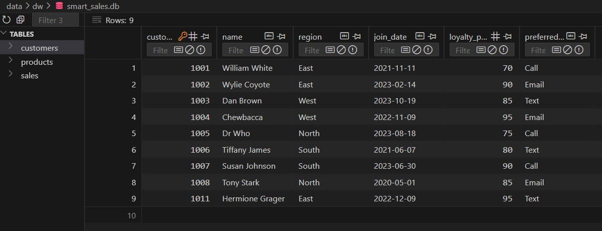
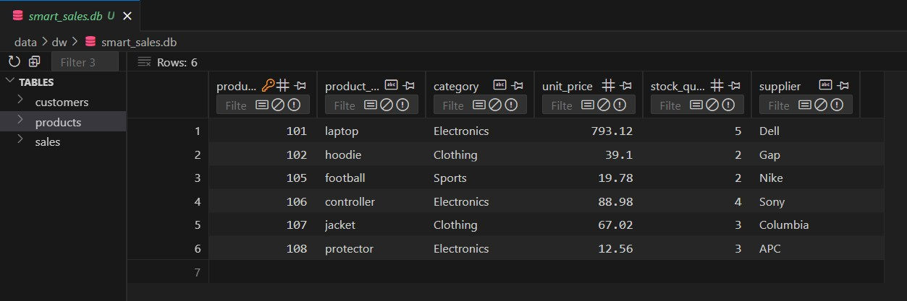
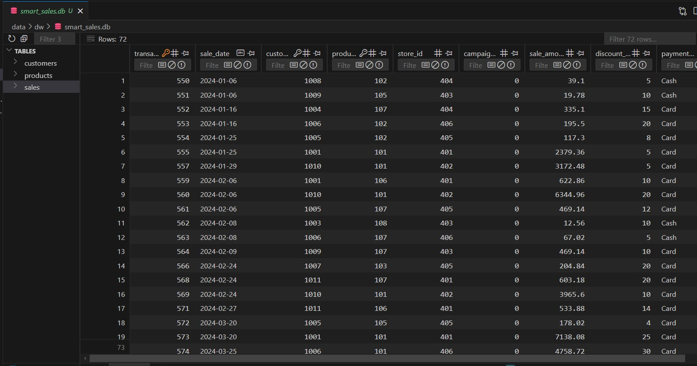

# smart-store-sgollanw

-----

## Project Setup Guide (1-Mac/Linux)

Run all commands from a terminal in the root project folder. 

## Initial Package List (For Reference)

```
pip
setuptools
wheel
loguru
python-dotenv
pyttsx3
ipython
jupyter
ipykernel
ipywidgets
pandas
matplotlib
seaborn
```

## Commands Used (Frequently) to update GitHub 

```
# to check the status
git status
# to stage the files
git add .
# to commit with message
git commit -m "<<message to commit>>"
# to push into remote branch
git push -u origin main
```

### Step 1A - Create a Local Project Virtual Environment

```shell
python3 -m venv .venv
```

### Step 1B - Activate the Virtual Environment

```shell
source .venv/bin/activate
```

### Step 1C - Install Packages

```shell
python3 -m pip install --upgrade -r requirements.txt
```

### Step 1D - Optional: Verify .venv Setup

```shell
python3 -m datafun_venv_checker.venv_checker
```

### Step 1E - Run the initial project script

```shell
python3 scripts/data_prep.py
```

### Step 1F - Run the Data Preparation Scripts to cleanup the data

```shell
python3 scripts/data_preparation/prepare_customers_data.py
python3 scripts/data_preparation/prepare_products_data.py
python3 scripts/data_preparation/prepare_sales_data.py
```

-----

## Project Setup Guide (2-Windows)

Run all commands from a PowerShell terminal in the root project folder.

### Step 2A - Create a Local Project Virtual Environment

```shell
py -m venv .venv
```

### Step 2B - Activate the Virtual Environment

```shell
.venv\Scripts\activate
```

### Step 2C - Install Packages

```shell
py -m pip install --upgrade -r requirements.txt
```

### Step 2D - Optional: Verify .venv Setup

```shell
py -m datafun_venv_checker.venv_checker
```

### Step 2E - Run the initial project script

```shell
py scripts/data_prep.py
```

### Step 2F - Run the Data Preparation Scripts to cleanup the data

```shell
py scripts/data_preparation/prepare_customers_data.py
py scripts/data_preparation/prepare_products_data.py
py scripts/data_preparation/prepare_sales_data.py
```

-----

### Data warehouse data screenshots / reference

Customers data:



Products data:



Sales data:



-----

